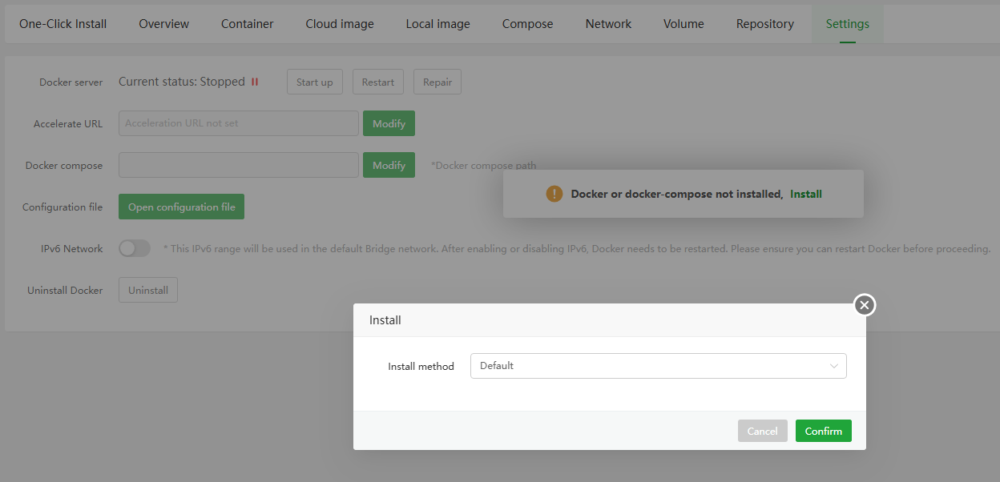
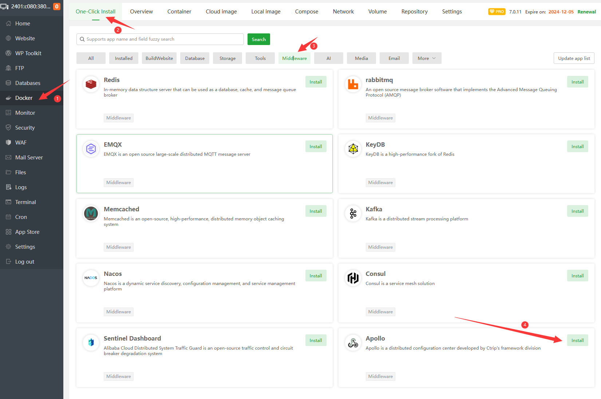
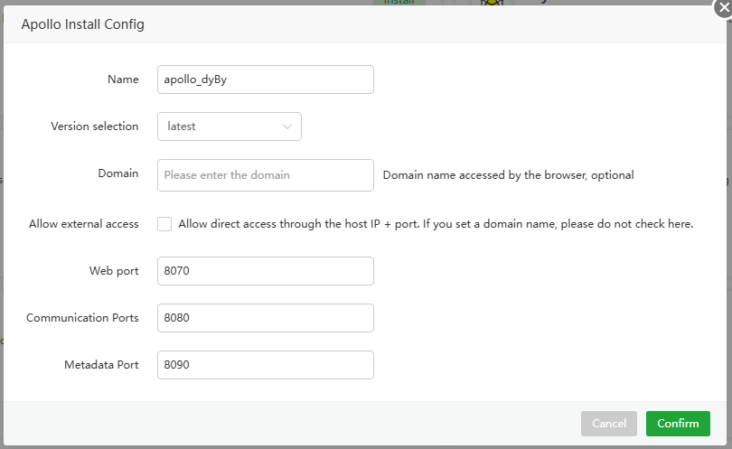
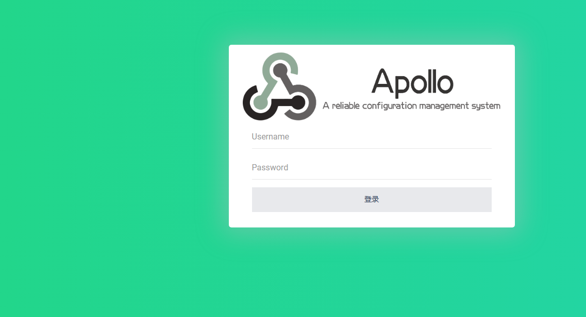

## aaPanel Docker One-Click Install

Go to [aaPanel official website](https://www.aapanel.com/new/download.html), Select the script to download and install(Skip this step if you already have it installed)

# Deploy Apollo using aaPanel

## Prerequisite

To install aaPanel, go to the [aaPanel](https://www.aapanel.com/new/download.html#install) official website and select the corresponding script to download and install.

## Deployment

aaPanel(Applicable versions 7.0.11 and above) Deployment guidelines

1. Log in to aaPanel and click `Docker` in the menu bar

   

2. The first time you will be prompted to install the `Docker` and `Docker Compose` services, click Install Now. If it is already installed, please ignore it.

   

3. After the installation is complete, find `Apollo` in `One-Click Install` and click `install`  

   

4. configure basic information such as the domain name, ports to complete the installation

   Note:
   The domain is optional. If a domain is provided, it can be managed through [Website] --> [Proxy Project]. In this case, you do not need to check [Allow external access]. However, if no domain is provided, you must check [Allow external access] to enable port-based access.

   

5. After installation, enter the domain name or IP+ port set in the previous step in the browser to access.
- Name: application name, default `Apollo-characters`
- Version selection: default `latest`
- Domain name: If you need to access directly through the domain name, please configure the domain name here and resolve the domain name to the server
- Allow external access: If you need direct access through `IP+Port`, please check. If you have set up a domain name, please do not check here.
- Web port: Default `8070`, can be modified by yourself
- Communication port: Default `8080`, can be modified by yourself
- Metadata port: Default `8090`, can be modified by yourself
- **Security Note:**
  - Ensure these ports are not exposed directly to the internet
  - Configure your firewall to restrict access to these ports
  - Verify that these ports are not already in use by other services

6. After submission, the panel will automatically initialize the application, which will take about `1-3` minutes. It can be accessed after the initialization is completed.

## Access Methods

1. **Domain Name Access**
   - URL Format: `http://<your-domain>`
   - Example: `http://demo.apollo.org`

   **Enable HTTPS (Suggestion):**
   1. Obtain an SSL certificate (recommended providers: Let's Encrypt, Certbot)
   2. In aaPanel, go to [Website] -> [SSL]
   3. Install your SSL certificate
   4. Force HTTPS redirect for enhanced security

   After SSL configuration:
   - URL Format: `https://<your-domain>`
   - Example: `https://demo.apollo.org`

2. **IP and Port Access**
   - URL Format: `http://<aaPanelIP>:8070`
   - Note: Requires "Allow external access" to be enabled

> Default credentials: username `apollo`, password `admin`, please change the default password immediately.

