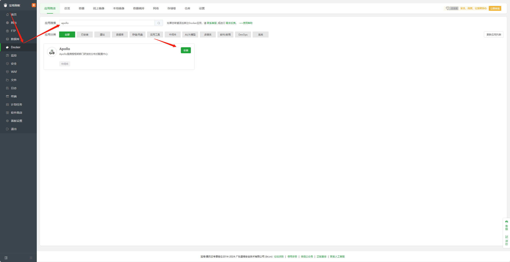

# 基于宝塔面板部署 Apollo

## 前提

- 仅适用于宝塔面板9.2.0及以上版本
- 安装宝塔面板，前往[宝塔面板](https://www.bt.cn/new/index.html)官网，选择正式版的脚本下载安装

## 部署

1. 登录宝塔面板，在左侧菜单栏中点击 `Docker`

2. 首次会提示安装`Docker`和`Docker Compose`服务，点击立即安装，若已安装请忽略。

3. 安装完成后在`Docker-应用商店`中找到 `Apollo`，点击`安装`

4. 设置域名等基本信息，点击`确定`
- 名称：应用名称，默认`apollo_随机字符`
- 版本选择：默认`latest`
- 允许外部访问：如您需通过`IP+Port`直接访问，请勾选，如您已经设置了域名，请不要勾选此处
- WEB 端口：默认`8070`，可自行修改
- 通信端口：默认`8080`，可自行修改
- 元数据端口：默认`8090`，可自行修改
- **安全须知：**
  - 请确保这些端口没有直接暴露在互联网上
  - 配置您的防火墙以限制对这些端口的访问
  - 验证这些端口没有被其他服务占用

5. 提交后面板会自动进行应用初始化，大概需要`1-3`分钟，初始化完成后即可访问

## 访问 Apollo
- 请在浏览器地址栏中输入域名访问 `http://<宝塔面板IP>:8070`，即可访问 `Apollo` 控制台。

> 默认登录信息: username `apollo`, password `admin`，为了服务器安全，请在登陆后立即修改密码。

